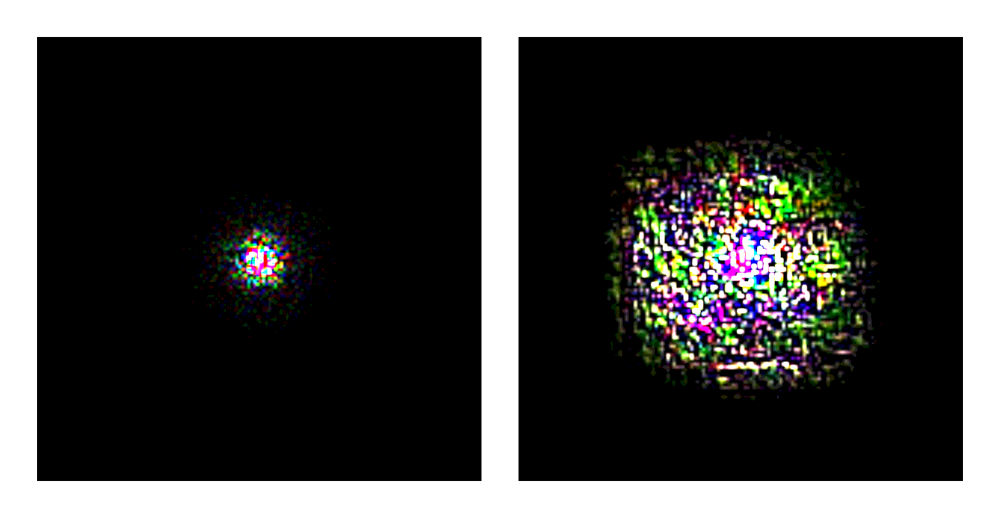
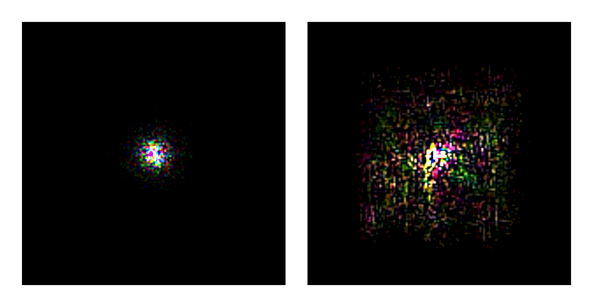
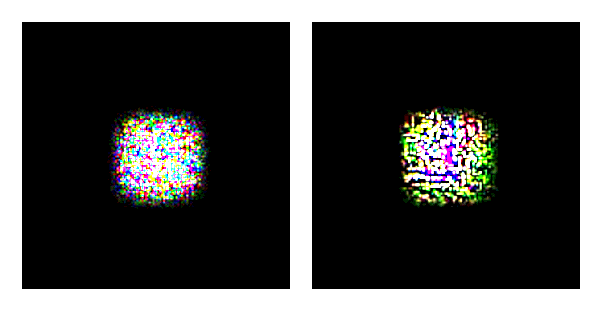
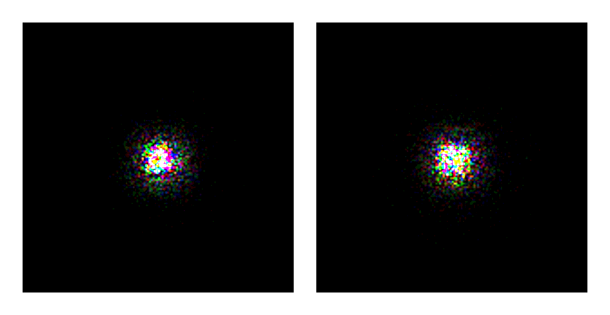

To better analyze the output of a neural network for a segmentation task it sometimes helps to look at the effective receptive field (ERF) of a neuron in the output layer. A short (not mathematical) explanation how perceptive fields increase for different combinations of layer types can be found [here](./Methods-for-increasing-the-field-of-view). However the described increase is only true if all weights in the convolutional layers would be 1. Due to different weights in a trained network the effective receptive field differs from the theoretical one. Therefore a mathematical calculation of the effective receptive field is needed. Below you can find a short explanation for the calculation. A more detailed explanation can be found in [1].

### Calculation
The effective receptive field is defined as the partial derivative of the center pixel of the output map with respect to the input map. This gets computed by using back-propagation that needs an initial error gradient and reasonable input data. The error gradient is set to 1 at the center and 0 for all other pixel. To get an effective receptive field which is specific to the training task, some samples from the data can be used as input images. The computation  of the partial derivative is then computed for all images and the effective receptive field is averaged over all runs.

### Comparison between different architectures
The full validation dataset has been used as input data for the gradient calculation. The effective receptive field has then been calculated by averaging over all results. The implementation can be found [here](https://github.com/mcFloskel/houseNet/blob/master/analysis/effective_receptive_field.py) and an example [here](https://github.com/mcFloskel/houseNet/blob/master/analysis/example_erf.py). The resolution of the images below has been increased from the original 150x150 to 600x600. Additionally the color levels have been reduced to 16 so that the different pixels values can more easily been distinguished. All images show the effective receptive field for the untrained network on the left and the trained network on the right.

#### Results

The computation for the UNet architecture shows the expected result for the ERF. An initially small receptive field enlarges during training to a bigger one. This also applies for the UNet architecture with the added ASPP block in the deepest layer. However the ASPP block changes the shape of the receptive field significantly. The more gaussian shaped ERF from the untrained network changes to a rectangular shape. This can be explained by the usage of dilated convolution which enlarges the receptive field directly with a dilated grid. This is even more noticeable in the ERF of the DNet architecture. The architecture consists mostly of convolutions with dilated kernels which results in a rectangular shaped ERF for the untrained and trained network. While the initial size of the effective receptive field for the DNet architecture is bigger than for the UNet architecture it does not increase significantly during training.
The initial ERF is big due to the usage of dilated convolution. However these were used to replace additional pooling layers (or convolution layers with strides) which might have increased the receptive field more. All three mentioned architectures have a visible difference between the untrained and trained ERF computations. This does not apply for the RNet architecture. This may result from the complex architecture of the network. The network is a mixture of a residual network and a U-Net architecture with additional usage of dilated convolutions. To better understand the effect of these components a more deeper analysis has to be made.

#### UNet ([code](https://github.com/mcFloskel/houseNet/blob/master/networks/uNet3.py))

#### UNet + ASPP ([code](https://github.com/mcFloskel/houseNet/blob/master/networks/uNet_aspp.py))

#### DNet ([code](https://github.com/mcFloskel/houseNet/blob/master/networks/dNet.py))

#### RNet ([code](https://github.com/mcFloskel/houseNet/blob/master/networks/rNet.py))

### References
[1] Wenjie Luo, Yujia Li, Raquel Urtasun, Richard Zemel **Understanding the Effective Receptive Field in Deep Convolutional Neural Networks** ([arXiv](https://arxiv.org/abs/1701.04128))