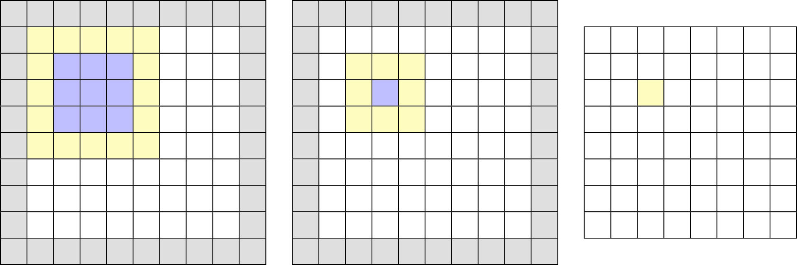
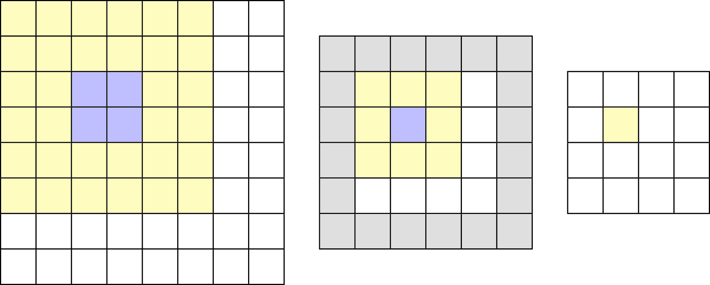
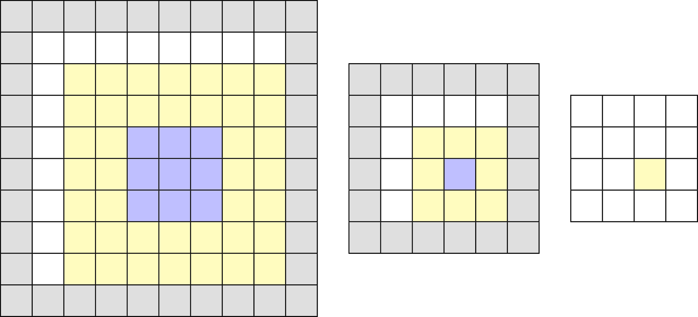
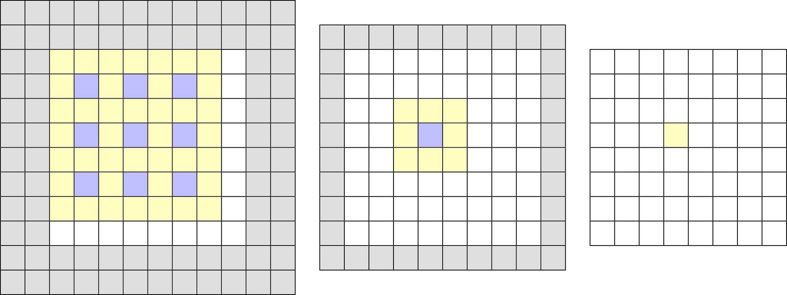

## Methods for increasing the field of view
A common approach to improve the performance of artificial neural networks is to increase the field of view for each neuron. This is often achieved by using convolutional layers in the network architecture. The field of view of a convolutional neuron is equal to the size of the used kernel, for example 3x3. While the field of view on the input data is always related to its kernel size, the field of view on the source data is extended by appending layers to the network. The increase in the field of view depends on the used method and is explained below.

### Consecutive Convolutions

||1st Layer -> Input|2nd Layer -> 1st Layer|2nd Layer -> Input|
|-|-|-|-|
|Field of View|3x3|3x3|5x5|

Performing two convolutions consecutively results in an increased field of view of the second convolutional layer on the input data. While the second layer has the same kernel size as the first layer, the second convolution is performed on activation maps, where each activation itself resulted from a convolution. Thus the second convolution collects also information from the surrounding data points of the first convolution.
 
### Pooling and Convolution

||1st Layer -> Input|2nd Layer -> 1st Layer|2nd Layer -> Input|
|-|-|-|-|
|Field of View|2x2|3x3|6x6|

One reason for using a pooling layer in neural networks is to decrease the data resolution for following layers, which results in fewer number of weights for the succeeding layer. This allows to use an increased number of filter kernels in the following convolutional layer. However pooling also increases the the field of view for the following convolution due to the aggregation of data points inside the pooling layer.

### Convolution with Stride

||1st Layer -> Input|2nd Layer -> 1st Layer|2nd Layer -> Input|
|-|-|-|-|
|Field of View|3x3|3x3|7x7|

Another method for decreasing the data resolution for the following layer is to use a convolutional layer with a stride > 1. This means that the filter kernel is not shifted by one point on the input data but by a given number of strides (2 in the above example). In some recent architectures ([here](https://arxiv.org/abs/1802.02611v3) or [here](http://openaccess.thecvf.com/content_cvpr_2017/papers/Yu_Dilated_Residual_Networks_CVPR_2017_paper.pdf))  2x2 pooling layers are replaced by convolutional layers with stride=2 which decreases the data resolution by the same factor. (The reason for this depends on the architecture and the given task). The reason for the increased field of view of a succeeding convolutional layer is the same as for the regular consecutive convolutions (as explained above) but due to the used stride the field of view is increased even further.

### Dilated Convolution

||1st Layer -> Input|2nd Layer -> 1st Layer|2nd Layer -> Input|
|-|-|-|-|
|Field of View|5x5|3x3|7x7|

Using dilated convolutions directly increases the field of view of a convolutional layer. This is achieved by dilating the filter kernel and leaving out a certain amount of data points (In the above example the dilation rate is 2, which means that the kernel weights are placed with a distance of 2 on the input data). An advantage of dilated convolutions is therefore the increased field of view without decreasing resolution or an increase in the amount of filter weights. The succeeding convolutional layer increases the field of view in the same way as two consecutive convolutions (as explained above).