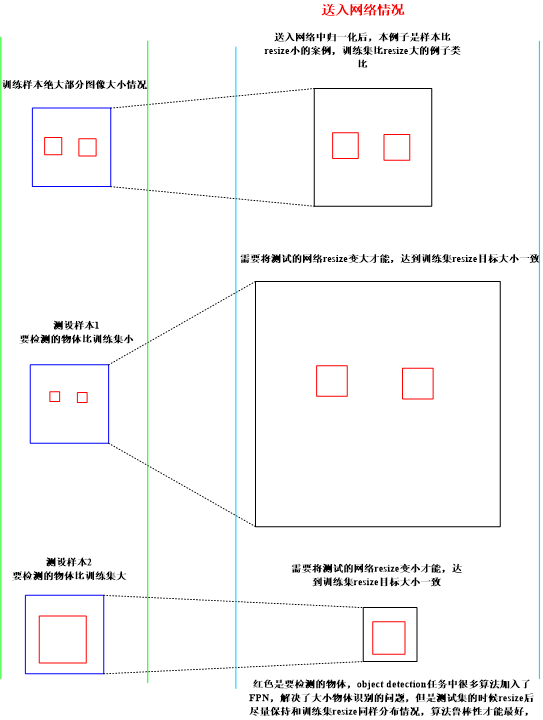

## 工程性：

1、具体问题具体分析，良好的数据集构建是成功的一半。

2、目标检测识别两类，目标类和背景(多类目标统一作为一类)，进而将目标检测的得到的图片类送入分类网络进行分类(多类目标和背景类进而分出来)-----为了提高精度。

3、缩放比例

一些目标和场景未必需要保持图像比例：行人太细可以考虑拉宽点分辨率训练；一些车道检测也会通过

视角变化来获得更好效果，或者方便使用传统方法快速检测。

4、注意图像带有的旋转角度信息对检测影响，尽量消除图像带有旋转角度信息。

持续整理中ing:

## 资料的汇总：

一些改进模型速度/精度的工程方法

- https://mp.weixin.qq.com/s/aPXnvigB0Ek76Gwg2b7_ZA

小目标检测相关技巧总结

- https://mp.weixin.qq.com/s/BGhJXncEKXVpm2aglMkFnw

样本不平衡问题 | 目标检测

- https://mp.weixin.qq.com/s/qEakFFMJJmxic8V1FBD00w

目标检测比赛中的trick

- https://mp.weixin.qq.com/s/zrgZiDvD1wrQDEectIsw4g

sample-free（样本不平衡）

- https://mp.weixin.qq.com/s/jYriJtVMyDz9GJiQ0RnMvw

拯救小目标检测！Tiny Person数据集和SM尺度匹配小目标检测新方法

- https://github.com/ucas-vg/TinyBenchmark
- https://mp.weixin.qq.com/s/qMPWngipm3WJOX7LnX50uw

目标检测系列三：奇技淫巧

- http://www.spytensor.com/index.php/archives/53/

小目标检测论文/相关资源大列表

- https://github.com/kuanhungchen/awesome-tiny-object-detection

**目标检测比赛：**

一些比赛汇总链接，里面的技巧也可以拿来学习：

目标检测比赛入门：

- https://tianchi.aliyun.com/course/video?liveId=41141

天池铝材缺陷检测：

- http://note.youdao.com/noteshare?id=ff72e93cce5ab64cc2b03e5a1b970825&sub=WEB9214dcedc980540f79ec8dd89e3ff766

津南数字制造算法挑战赛：

- http://note.youdao.com/noteshare?id=42e0451a1ecebcfb5508ea43a396133f&sub=7DE0A25A06EE4612BC1A8DB91862510E

布匹缺陷检测---2019广东工业智造创新大赛【赛场一】：

- http://note.youdao.com/noteshare?id=c62edad0ab5a94c1bc4e0183907a72ed&sub=WEBb7fcc53dc5019cf154e3dbd05aae19a6

天池瓶装酒的瑕疵：

- http://note.youdao.com/noteshare?id=53ff742214b4dac5d8740a4b312547be&sub=WEBf588af34b2f66a2292aebcb0ac388f6e

Crowdhuman人体检测比赛第一名经验总结：

- https://zhuanlan.zhihu.com/p/68677880

## 基础目标检测算法的某部分魔改-技巧

- [http://note.youdao.com/noteshare?id=60fb43c21f59fd96829aaeddc305801f&](http://note.youdao.com/noteshare?id=60fb43c21f59fd96829aaeddc305801f&sub=9CDE6A41EE024965BB712B2DCAA738FE)