本文首先将介绍在目标跟踪任务中常用的匈牙利算法（Hungarian Algorithm）和卡尔曼滤波（Kalman Filter），然后介绍经典算法DeepSORT的工作流程以及对相关源码进行解析。

目前主流的目标跟踪算法都是基于Tracking-by-Detecton策略，即基于目标检测的结果来进行目标跟踪。DeepSORT运用的就是这个策略，上面的视频是DeepSORT对人群进行跟踪的结果，每个bbox左上角的数字是用来标识某个人的唯一ID号。

这里就有个问题，视频中不同时刻的同一个人，位置发生了变化，那么是如何关联上的呢？答案就是匈牙利算法和卡尔曼滤波。

* 匈牙利算法可以告诉我们当前帧的某个目标，是否与前一帧的某个目标相同。
* 卡尔曼滤波可以基于目标前一时刻的位置，来预测当前时刻的位置，并且可以比传感器（在目标跟踪中即目标检测器，比如Yolo等）更准确的估计目标的位置。

匈牙利算法（Hungarian Algorithm）

首先，先介绍一下什么是分配问题（Assignment Problem）：假设有N个人和N个任务，每个任务可以任意分配给不同的人，已知每个人完成每个任务要花费的代价不尽相同，那么如何分配可以使得总的代价最小。

举个例子，假设现在有3个任务，要分别分配给3个人，每个人完成各个任务所需代价矩阵（cost matrix）如下所示（这个代价可以是金钱、时间等等）：

怎样才能找到一个最优分配，使得完成所有任务花费的代价最小呢？

匈牙利算法（又叫KM算法）就是用来解决分配问题的一种方法，它基于定理：

    如果代价矩阵的某一行或某一列同时加上或减去某个数，则这个新的代价矩阵的最优分配仍然是原代价矩阵的最优分配。

算法步骤（假设矩阵为NxN方阵）：

1、对于矩阵的每一行，减去其中最小的元素
2、对于矩阵的每一列，减去其中最小的元素
3、用最少的水平线或垂直线覆盖矩阵中所有的0
4、如果线的数量等于N，则找到了最优分配，算法结束，否则进入步骤
5、找到没有被任何线覆盖的最小元素，每个没被线覆盖的行减去这个元素，每个被线覆盖的列加上这个元素，返回步骤3

继续拿上面的例子做演示：

step1 每一行最小的元素分别为15、20、20，减去得到：
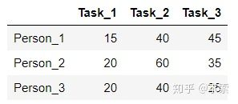
step2 每一列最小的元素分别为0、20、5，减去得到：
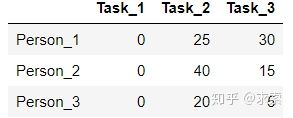
step3 用最少的水平线或垂直线覆盖所有的0，得到：
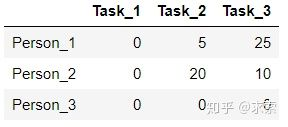
step4 线的数量为2，小于3，进入下一步；
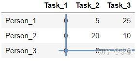
step5 现在没被覆盖的最小元素是5，没被覆盖的行（第一和第二行）减去5，得到：
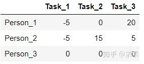
被覆盖的列（第一列）加上5，得到：
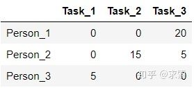
跳转到step3，用最少的水平线或垂直线覆盖所有的0，得到：
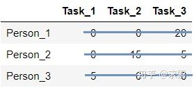
step4：线的数量为3，满足条件，算法结束。显然，将任务2分配给第1个人、任务1分配给第2个人、任务3分配给第3个人时，总的代价最小（0+0+0=0）：
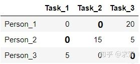
所以原矩阵的最小总代价为（40+20+25=85）：
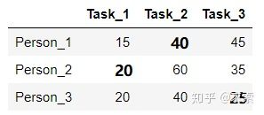
sklearn里的linear_assignment()函数以及scipy里的linear_sum_assignment()函数都实现了匈牙利算法，两者的返回值的形式不同：

```python
import numpy as np 
from sklearn.utils.linear_assignment_ import linear_assignment
from scipy.optimize import linear_sum_assignment
 

cost_matrix = np.array([
    [15,40,45],
    [20,60,35],
    [20,40,25]
])
 
matches = linear_assignment(cost_matrix)
print('sklearn API result:\n', matches)
matches = linear_sum_assignment(cost_matrix)
print('scipy API result:\n', matches)
 

"""Outputs
sklearn API result:
 [[0 1]
  [1 0]
  [2 2]]
scipy API result:
 (array([0, 1, 2], dtype=int64), array([1, 0, 2], dtype=int64))
"""


在DeepSORT中，匈牙利算法用来将前一帧中的跟踪框tracks与当前帧中的检测框detections进行关联，通过外观信息（appearance information）和马氏距离（Mahalanobis distance），或者IOU来计算代价矩阵。

```python
#  linear_assignment.py
def min_cost_matching(distance_metric, max_distance, tracks, detections, 
                      track_indices=None, detection_indices=None):
    ...
    
    # 计算代价矩阵
    cost_matrix = distance_metric(tracks, detections, track_indices, detection_indices)
    cost_matrix[cost_matrix > max_distance] = max_distance + 1e-5
    
    # 执行匈牙利算法，得到匹配成功的索引对，行索引为tracks的索引，列索引为detections的索引
    row_indices, col_indices = linear_assignment(cost_matrix)
 
    matches, unmatched_tracks, unmatched_detections = [], [], []
 
    # 找出未匹配的detections
    for col, detection_idx in enumerate(detection_indices):
        if col not in col_indices:
            unmatched_detections.append(detection_idx)
     
    # 找出未匹配的tracks
    for row, track_idx in enumerate(track_indices):
        if row not in row_indices:
            unmatched_tracks.append(track_idx)
    
    # 遍历匹配的(track, detection)索引对
    for row, col in zip(row_indices, col_indices):
        track_idx = track_indices[row]
        detection_idx = detection_indices[col]
        # 如果相应的cost大于阈值max_distance，也视为未匹配成功
        if cost_matrix[row, col] > max_distance:
            unmatched_tracks.append(track_idx)
            unmatched_detections.append(detection_idx)
        else:
            matches.append((track_idx, detection_idx))
 
    return matches, unmatched_tracks, unmatched_detections
```

## 卡尔曼滤波（Kalman Filter）

卡尔曼滤波被广泛应用于无人机、自动驾驶、卫星导航等领域，简单来说，其作用就是基于传感器的测量值来更新预测值，以达到更精确的估计。
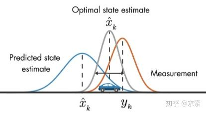
假设我们要跟踪小车的位置变化，如下图所示，蓝色的分布是卡尔曼滤波预测值，棕色的分布是传感器的测量值，灰色的分布就是预测值基于测量值更新后的最优估计。

在目标跟踪中，需要估计track的以下两个状态：

    均值(Mean)：表示目标的位置信息，由bbox的中心坐标 (cx, cy)，宽高比r，高h，以及各自的速度变化值组成，由8维向量表示为 x = [cx, cy, r, h, vx, vy, vr, vh]，各个速度值初始化为0。协方差(Covariance )：表示目标位置信息的不确定性，由8x8的对角矩阵表示，矩阵中数字越大则表明不确定性越大，可以以任意值初始化。

卡尔曼滤波分为两个阶段：(1) 预测track在下一时刻的位置，(2) 基于detection来更新预测的位置。

下面将介绍这两个阶段用到的计算公式。（这里不涉及公式的原理推导，因为我也不清楚原理(ಥ_ಥ) ，只是说明一下各个公式的作用）

预测

    基于track在t-1时刻的状态来预测其在t时刻的状态。 


在公式1中，x为track在t-1时刻的均值，F称为状态转移矩阵，该公式预测t时刻的x'：
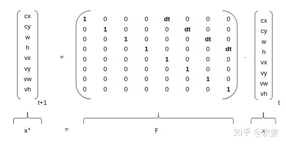

矩阵F中的dt是当前帧和前一帧之间的差，将等号右边的矩阵乘法展开，可以得到cx'=cx+dt*vx，cy'=cy+dt*vy...，所以这里的卡尔曼滤波是一个匀速模型（Constant Velocity Model）。

在公式2中，P为track在t-1时刻的协方差，Q为系统的噪声矩阵，代表整个系统的可靠程度，一般初始化为很小的值，该公式预测t时刻的P'。

源码解读：

```python
#  kalman_filter.py
def predict(self, mean, covariance):
    """Run Kalman filter prediction step.
    
    Parameters
    ----------
    mean: ndarray, the 8 dimensional mean vector of the object state at the previous time step.
    covariance: ndarray, the 8x8 dimensional covariance matrix of the object state at the previous time step.
 
    Returns
    -------
    (ndarray, ndarray), the mean vector and covariance matrix of the predicted state. 
     Unobserved velocities are initialized to 0 mean.
    """
    std_pos = [
        self._std_weight_position * mean[3],
        self._std_weight_position * mean[3],
        1e-2,
        self._std_weight_position * mean[3]]
    std_vel = [
        self._std_weight_velocity * mean[3],
        self._std_weight_velocity * mean[3],
        1e-5,
        self._std_weight_velocity * mean[3]]
    
    motion_cov = np.diag(np.square(np.r_[std_pos, std_vel]))  # 初始化噪声矩阵Q
    mean = np.dot(self._motion_mat, mean)  # x' = Fx
    covariance = np.linalg.multi_dot((self._motion_mat, covariance, self._motion_mat.T)) + motion_cov  # P' = FPF(T) + Q
 
    return mean, covariance
```

### 更新

    基于t时刻检测到的detection，校正与其关联的track的状态，得到一个更精确的结果。


在公式3中，z为detection的均值向量，不包含速度变化值，即z=[cx, cy, r, h]，H称为测量矩阵，它将track的均值向量x'映射到检测空间，该公式计算detection和track的均值误差；

在公式4中，R为检测器的噪声矩阵，它是一个4x4的对角矩阵，对角线上的值分别为中心点两个坐标以及宽高的噪声，以任意值初始化，一般设置宽高的噪声大于中心点的噪声，该公式先将协方差矩阵P'映射到检测空间，然后再加上噪声矩阵R；

公式5计算卡尔曼增益K，卡尔曼增益用于估计误差的重要程度；

公式6和公式7得到更新后的均值向量x和协方差矩阵P。

源码解读：
```python
#  kalman_filter.py
def project(self, mean, covariance):
    """Project state distribution to measurement space.
        
    Parameters
    ----------
    mean: ndarray, the state's mean vector (8 dimensional array).
    covariance: ndarray, the state's covariance matrix (8x8 dimensional).

    Returns
    -------
    (ndarray, ndarray), the projected mean and covariance matrix of the given state estimate.
    """
    std = [self._std_weight_position * mean[3],
           self._std_weight_position * mean[3],
           1e-1,
           self._std_weight_position * mean[3]]
        
    innovation_cov = np.diag(np.square(std))  # 初始化噪声矩阵R
    mean = np.dot(self._update_mat, mean)  # 将均值向量映射到检测空间，即Hx'
    covariance = np.linalg.multi_dot((
        self._update_mat, covariance, self._update_mat.T))  # 将协方差矩阵映射到检测空间，即HP'H^T
    return mean, covariance + innovation_cov


def update(self, mean, covariance, measurement):
    """Run Kalman filter correction step.

    Parameters
    ----------
    mean: ndarra, the predicted state's mean vector (8 dimensional).
    covariance: ndarray, the state's covariance matrix (8x8 dimensional).
    measurement: ndarray, the 4 dimensional measurement vector (x, y, a, h), where (x, y) is the 
                 center position, a the aspect ratio, and h the height of the bounding box.
    Returns
    -------
    (ndarray, ndarray), the measurement-corrected state distribution.
    """
    # 将mean和covariance映射到检测空间，得到Hx'和S
    projected_mean, projected_cov = self.project(mean, covariance)
    # 矩阵分解（这一步没看懂）
    chol_factor, lower = scipy.linalg.cho_factor(projected_cov, lower=True, check_finite=False)
    # 计算卡尔曼增益K（这一步没看明白是如何对应上公式5的，求线代大佬指教）
    kalman_gain = scipy.linalg.cho_solve(
            (chol_factor, lower), np.dot(covariance, self._update_mat.T).T,
            check_finite=False).T
    # z - Hx'
    innovation = measurement - projected_mean
    # x = x' + Ky
    new_mean = mean + np.dot(innovation, kalman_gain.T)
    # P = (I - KH)P'
    new_covariance = covariance - np.linalg.multi_dot((kalman_gain, projected_cov, kalman_gain.T))
        
    return new_mean, new_covariance
```

## DeepSort工作流程

### DeepSORT对每一帧的处理流程如下：

检测器得到bbox → 生成detections → 卡尔曼滤波预测→ 使用匈牙利算法将预测后的tracks和当前帧中的detecions进行匹配（级联匹配和IOU匹配） → 卡尔曼滤波更新

* Frame 0：检测器检测到了3个detections，当前没有任何tracks，将这3个detections初始化为tracks
* Frame 1：检测器又检测到了3个detections，对于Frame 0中的tracks，先进行预测得到新的tracks，然后使用匈牙利算法将新的tracks与detections进行匹配，得到(track, detection)匹配对，最后用每对中的detection更新对应的track 

## 检测

使用Yolo作为检测器，检测当前帧中的bbox：
```python
#  demo_yolo3_deepsort.py
def detect(self):
    while self.vdo.grab():
	...
	bbox_xcycwh, cls_conf, cls_ids = self.yolo3(im)  # 检测到的bbox[cx,cy,w,h]，置信度，类别id
	if bbox_xcycwh is not None:
    	    # 筛选出人的类别
    	    mask = cls_ids == 0
  	    bbox_xcycwh = bbox_xcycwh[mask]
  	    bbox_xcycwh[:, 3:] *= 1.2
   	    cls_conf = cls_conf[mask]
            ...
```

### 生成detections

将检测到的bbox转换成detections：
```python
#  deep_sort.py
def update(self, bbox_xywh, confidences, ori_img):
    self.height, self.width = ori_img.shape[:2]
    # 提取每个bbox的feature
    features = self._get_features(bbox_xywh, ori_img)
    # [cx,cy,w,h] -> [x1,y1,w,h]
    bbox_tlwh = self._xywh_to_tlwh(bbox_xywh)
    # 过滤掉置信度小于self.min_confidence的bbox，生成detections
    detections = [Detection(bbox_tlwh[i], conf, features[i]) for i,conf in enumerate(confidences) if conf > self.min_confidence]
    # NMS (这里self.nms_max_overlap的值为1，即保留了所有的detections)
    boxes = np.array([d.tlwh for d in detections])
    scores = np.array([d.confidence for d in detections])
    indices = non_max_suppression(boxes, self.nms_max_overlap, scores)
    detections = [detections[i] for i in indices]
    ...
```
### 卡尔曼滤波预测阶段

使用卡尔曼滤波预测前一帧中的tracks在当前帧的状态：
```python
#  track.py
def predict(self, kf):
    """Propagate the state distribution to the current time step using a 
       Kalman filter prediction step.
    Parameters
    ----------
    kf: The Kalman filter.
    """
    self.mean, self.covariance = kf.predict(self.mean, self.covariance)  # 预测
    self.age += 1  # 该track自出现以来的总帧数加1
    self.time_since_update += 1  # 该track自最近一次更新以来的总帧数加1
```

### 匹配

首先对基于外观信息的马氏距离计算tracks和detections的代价矩阵，然后相继进行级联匹配和IOU匹配，最后得到当前帧的所有匹配对、未匹配的tracks以及未匹配的detections：
```python
#  tracker.py
def _match(self, detections):
    def gated_metric(racks, dets, track_indices, detection_indices):
        """
        基于外观信息和马氏距离，计算卡尔曼滤波预测的tracks和当前时刻检测到的detections的代价矩阵
        """
        features = np.array([dets[i].feature for i in detection_indices])
        targets = np.array([tracks[i].track_id for i in track_indices]
	# 基于外观信息，计算tracks和detections的余弦距离代价矩阵
        cost_matrix = self.metric.distance(features, targets)
	# 基于马氏距离，过滤掉代价矩阵中一些不合适的项 (将其设置为一个较大的值)
        cost_matrix = linear_assignment.gate_cost_matrix(self.kf, cost_matrix, tracks, 
                      dets, track_indices, detection_indices)
        return cost_matrix

    # 区分开confirmed tracks和unconfirmed tracks
    confirmed_tracks = [i for i, t in enumerate(self.tracks) if t.is_confirmed()]
    unconfirmed_tracks = [i for i, t in enumerate(self.tracks) if not t.is_confirmed()]

    # 对confirmd tracks进行级联匹配
    matches_a, unmatched_tracks_a, unmatched_detections = \
        linear_assignment.matching_cascade(
            gated_metric, self.metric.matching_threshold, self.max_age,
            self.tracks, detections, confirmed_tracks)

    # 对级联匹配中未匹配的tracks和unconfirmed tracks中time_since_update为1的tracks进行IOU匹配
    iou_track_candidates = unconfirmed_tracks + [k for k in unmatched_tracks_a if
                                                 self.tracks[k].time_since_update == 1]
    unmatched_tracks_a = [k for k in unmatched_tracks_a if
                          self.tracks[k].time_since_update != 1]
    matches_b, unmatched_tracks_b, unmatched_detections = \
        linear_assignment.min_cost_matching(
            iou_matching.iou_cost, self.max_iou_distance, self.tracks,
            detections, iou_track_candidates, unmatched_detections)
	
    # 整合所有的匹配对和未匹配的tracks
    matches = matches_a + matches_b
    unmatched_tracks = list(set(unmatched_tracks_a + unmatched_tracks_b))
    
    return matches, unmatched_tracks, unmatched_detections


# 级联匹配源码  linear_assignment.py
def matching_cascade(distance_metric, max_distance, cascade_depth, tracks, detections,
                     track_indices=None, detection_indices=None):
    unmatched_detections = detection_indice
    matches = []
    # 由小到大依次对每个level的tracks做匹配
    for level in range(cascade_depth):
    # 如果没有detections，退出循环
        if len(unmatched_detections) == 0:  
            break
    # 当前level的所有tracks索引
        track_indices_l = [k for k in track_indices if
                           tracks[k].time_since_update == 1 + level]
    # 如果当前level没有track，继续
        if len(track_indices_l) == 0:
            continue

    # 匈牙利匹配
        matches_l, _, unmatched_detections = min_cost_matching(distance_metric, max_distance, tracks, detections, 
                                                               track_indices_l, unmatched_detections)

    matches += matches_l
    unmatched_tracks = list(set(track_indices) - set(k for k, _ in matches))
    return matches, unmatched_tracks, unmatched_detections
```

```python
# 级联匹配源码  linear_assignment.py
def matching_cascade(distance_metric, max_distance, cascade_depth, tracks, detections, 
                     track_indices=None, detection_indices=None):
    ...
    unmatched_detections = detection_indice
    matches = []
    # 由小到大依次对每个level的tracks做匹配
    for level in range(cascade_depth):
    # 如果没有detections，退出循环
        if len(unmatched_detections) == 0:  
            break
    # 当前level的所有tracks索引
        track_indices_l = [k for k in track_indices if 
                           tracks[k].time_since_update == 1 + level]
    # 如果当前level没有track，继续
        if len(track_indices_l) == 0: 
            continue

    # 匈牙利匹配
        matches_l, _, unmatched_detections = min_cost_matching(distance_metric, max_distance, tracks, detections, 
                                                               track_indices_l, unmatched_detections)

    matches += matches_l
    unmatched_tracks = list(set(track_indices) - set(k for k, _ in matches))
    return matches, unmatched_tracks, unmatched_detections
```
### 卡尔曼滤波更新阶段

对于每个匹配成功的track，用其对应的detection进行更新，并处理未匹配tracks和detections：
```python
#  tracker.py
def update(self, detections):
    """Perform measurement update and track management.
    Parameters
    ----------
    detections: List[deep_sort.detection.Detection]
                A list of detections at the current time step.
    """
    # 得到匹配对、未匹配的tracks、未匹配的dectections
    matches, unmatched_tracks, unmatched_detections = self._match(detections)

    # 对于每个匹配成功的track，用其对应的detection进行更新
    for track_idx, detection_idx in matches:
        self.tracks[track_idx].update(self.kf, detections[detection_idx])

    # 对于未匹配的成功的track，将其标记为丢失
    for track_idx in unmatched_tracks:
        self.tracks[track_idx].mark_missed()
    # 对于未匹配成功的detection，初始化为新的track
    for detection_idx in unmatched_detections:
        self._initiate_track(detections[detection_idx])
        ...
```